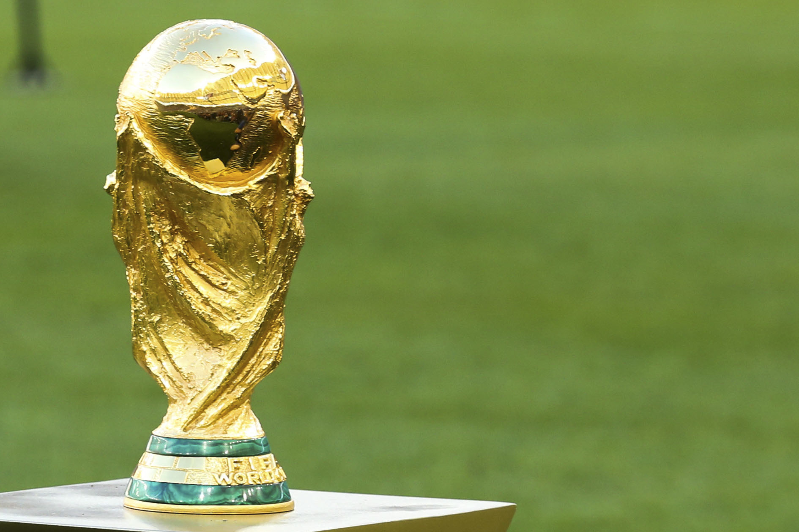
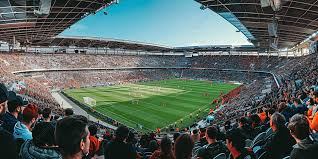
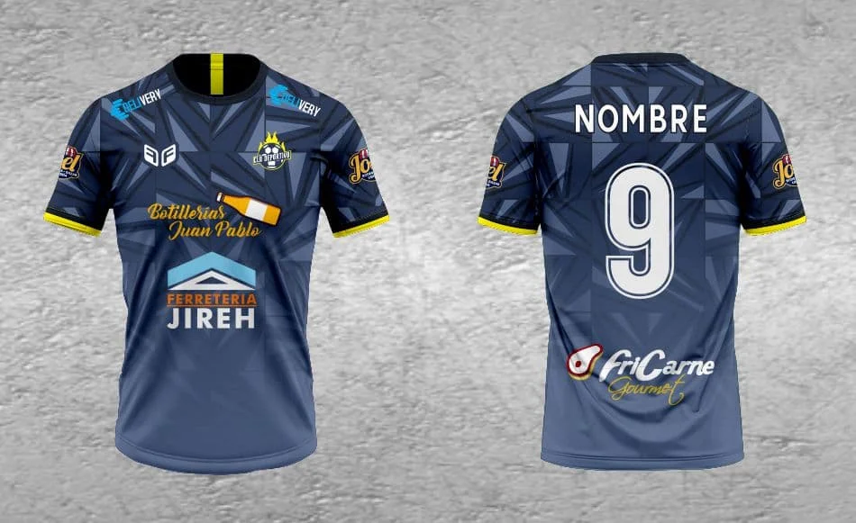

# La Economía del Fútbol

El fútbol no solo es el deporte más popular del mundo, sino también una de las industrias más lucrativas. A continuación, exploraremos los aspectos económicos más destacados de este deporte.

## 1. Ingresos por Derechos de Transmisión

Los derechos de transmisión son una de las principales fuentes de ingresos para los clubes y ligas de fútbol. Las cadenas de televisión y plataformas de streaming pagan sumas millonarias para transmitir los partidos.

- **Ejemplo de ligas con altos ingresos por derechos de transmisión:**
    - Premier League (Inglaterra)
    - LaLiga (España)
    - Serie A (Italia)

- **Factores que influyen en los ingresos:**
    - Popularidad de la liga.
    - Audiencia global.
    - Competitividad de los equipos.

[Más información sobre derechos de transmisión](https://www.fifa.com)

## 2. Patrocinios y Publicidad

Los patrocinios son otra fuente clave de ingresos. Las marcas invierten grandes cantidades para aparecer en camisetas, estadios y eventos relacionados con el fútbol.

- **Ejemplos de patrocinadores globales:**
    - Nike
    - Adidas
    - Coca-Cola

- **Beneficios para las marcas:**
    - Mayor visibilidad global.
    - Asociación con valores deportivos.

[Conoce más sobre patrocinios en el fútbol](https://www.uefa.com)

## 3. Transferencias de Jugadores

El mercado de transferencias mueve miles de millones de dólares cada año. Los clubes invierten en fichajes para mejorar su rendimiento deportivo y aumentar su valor de marca.

- **Transferencias más caras de la historia:**
    - Neymar Jr. al PSG.
    - Kylian Mbappé al PSG.
    - Philippe Coutinho al FC Barcelona.

[Consulta estadísticas del mercado de transferencias](https://www.transfermarkt.com)

## 4. Impacto Económico en las Comunidades

El fútbol también tiene un impacto significativo en las economías locales. Los estadios generan empleo y atraen turismo, beneficiando a las comunidades.

- **Ejemplos de impacto económico:**
    - Finales de torneos internacionales.
    - Construcción de estadios para eventos como el Mundial.

[Lee sobre el impacto económico del fútbol](https://www.economist.com)

---

### Imágenes Relacionadas

[Descubre más sobre la economía del fútbol](https://www.forbes.com)